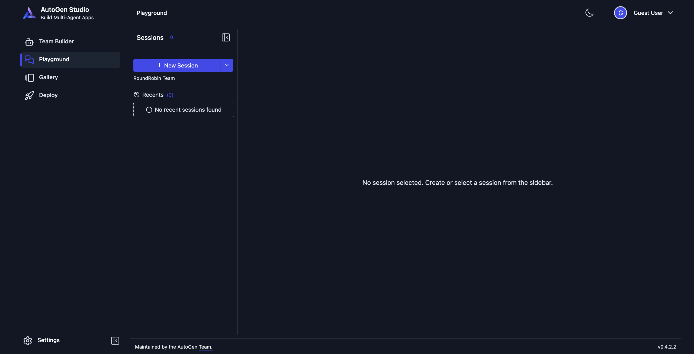

# Hands-on AI: Building Agentic SaaS Workflows with AutoGen Studio & OpenAI APIs

- This directory contains concepts and code related to creating agentic workflows using AutoGen studio & OpenAI APIs.
- You'll learn about the following concepts:
  1. How to build a small agentic workflow
  2. How Agentic AI Transforms SaaS
  3. Designing Reliable Agentic Workflows
  4. Feedback Classifier Agentic Workflows
     - Advanced Concepts
  5. Deploying to a Live Environment

## Requirements

1. Install [Python3](https://www.python.org/downloads/): Preferably 3.13+
   - Check if you've python already installed using the command: `python3 --version` in your terminal/cmd.
2. Create a virtual environment using python as follows:

   ```sh
   mkdir autogen-agentic-ai
   # Navigate to the created directory using: `cd autogen-agentic-ai`
   
   # From inside the autogen-agentic-ai directory, create a virtual environment and name it as .venv
   python -m venv .venv

   # Activate the virtual environment
   source .venv/bin/activate

   # To deactivate the virtual environment, just do the following:
   # deactivate
   ```

   You should something as follows in your terminal

   ```terminal
   (.venv) (base) Personal-MacBook-Pro ~/Documents/repos/personal/autogen-agentic-ai:(~|git@main!)
   ```

   The `(.venv)` in front of the terminal prompt is an indicator that the virtual environment is active. To deactivate the virtual environment, just run `deactivate`.
3. Install `autogen` package via `pip`:

   ```sh
   pip install autogenstudio
   ```

   > To check whether the installation is complete, use the following command:
   >
   > ```sh
   > pip list | grep autogen # Windows: pip list | findstr autogen
   > ```
   >
   > You should see a similar output:
   >
   > ```terminal
   > autogen-agentchat             0.5.7
   > autogen-core                  0.5.7
   > autogen-ext                   0.5.7
   > autogenstudio                 0.4.2.2
   > ```

4. Run the AutoGen Studio on port `8081`:

   ```py
   autogenstudio ui --port 8081
   ```

   You should see something similar:

   ```terminal
   2026-07-20 23:44:11.222 | INFO     | autogenstudio.web.app:lifespan:39 - Application startup complete. Navigate to http://127.0.0.1:8081
   ```

   > NOTE: If port `8081` is already being used by some other service, either stop that service,
   > or use a new port like `8082`, `8083`, etc.

   Once you open the localhost link, you should see something like follows:
   
